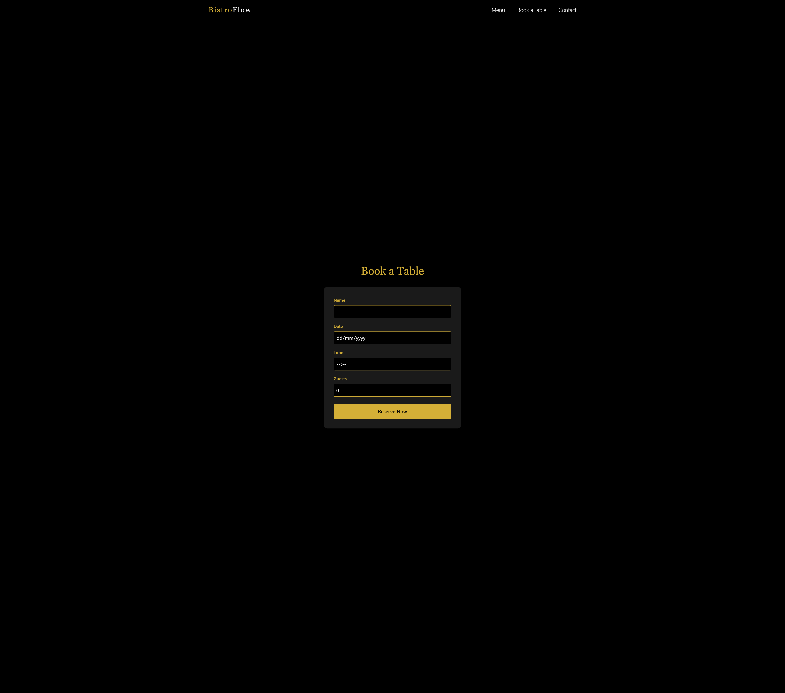

# 🍷 BistroFlow

A modern, luxury-themed full-stack restaurant web app built with **React**, **Node.js**, and **Express** — fully containerized with **Docker** and automated through a **CI/CD pipeline** using **GitHub Actions → Docker Hub → Render**.

---

## ✨ Overview

BistroFlow delivers a premium dining website experience with a rich front-end interface and dynamic backend API.  
Customers can browse an elegant menu, book tables online, and send contact messages — all powered by live backend data.

---

## 🧠 What I Learned

- Building a **full-stack web app** (React + Node.js + Express)
- Using **Docker** to containerize frontend & backend together
- Creating a **CI/CD pipeline** with **GitHub Actions**
- Hosting on **Render** with automatic deployments from Docker Hub
- Reading & writing **JSON data files** on the backend
- Connecting routes between frontend pages and backend APIs
- Debugging deployment issues (build errors, routing conflicts, missing files)
- Managing environment consistency between local dev and production

---

## 🛠️ Tech Stack

| Layer | Technologies |
|:------|:--------------|
| **Frontend** | React.js, Tailwind CSS, JavaScript |
| **Backend** | Node.js, Express.js, File System (fs) |
| **Database** | JSON files (menu, bookings, contacts) |
| **DevOps** | Docker, Docker Compose, GitHub Actions, Render |
| **Version Control** | Git, GitHub |

---

## ⚙️ Features

- 🏠 **Home Page:** Hero banner, about section, featured dishes  
- 🍽️ **Menu Page:** Fetches menu data dynamically from backend API  
- 📅 **Booking Page:** Submits reservations to backend and stores data in JSON  
- 💬 **Contact Section:** Contact form that sends messages to backend  
- 🌐 **Fully Responsive:** Built with Tailwind for all devices  
- 🔁 **Automated Deployments:** CI/CD from GitHub → Docker Hub → Render  

---

## 🧩 API Endpoints

| Method | Endpoint | Description |
|:-------|:----------|:-------------|
| \`GET\` | \`/api/menu\` | Fetch restaurant menu data |
| \`POST\` | \`/api/bookings\` | Save a table reservation |
| \`POST\` | \`/api/contact\` | Save a contact form submission |

---

## 🐳 Docker Setup

\`\`\`bash
# Build and run the app
docker compose up --build

# The app runs at:
# Frontend + Backend: http://localhost:5000
\`\`\`

---

## 🚀 CI/CD Pipeline

1️⃣ Push code to the main branch on GitHub  
2️⃣ GitHub Actions builds and pushes the Docker image to Docker Hub  
3️⃣ Render automatically detects the new image and redeploys the app  

**Workflow summary (GitHub Actions):**

\`\`\`yaml
name: CI/CD - Build and Push Full Stack App
on:
  push:
    branches: [ main ]

jobs:
  build_and_deploy:
    runs-on: ubuntu-latest
    steps:
      - name: Checkout code
        uses: actions/checkout@v4
      - name: Log in to Docker Hub
        run: echo "\${{ secrets.DOCKER_PASSWORD }}" | docker login -u "\${{ secrets.DOCKER_USERNAME }}" --password-stdin
      - name: Build Docker images
        run: docker compose build
      - name: Push Docker images
        run: docker compose push
\`\`\`

---

## 🌍 Live Demo

🔗 **Live App:** [https://bistroflow.onrender.com](https://bistroflow.onrender.com)

---

## 📸 Screenshots

## Homepage

---

## 🧭 Future Improvements

- Integrate a database (MongoDB / PostgreSQL)
- Add admin panel for managing menu & bookings
- Improve validation & error handling on forms
- Add user authentication for reservations

---

## 👨‍💻 Author

**Adeel Hussain**  
Front - End Developer | React | Node.js | Docker | CI/CD  
[LinkedIn](https://www.linkedin.com/in/adeel-hussain-47601786/) • [GitHub](https://github.com/AdeelH12)

---

## 🏁 License

MIT License © 2025 Adeel Hussain
EOF

echo "✅ README.md has been created successfully!"
